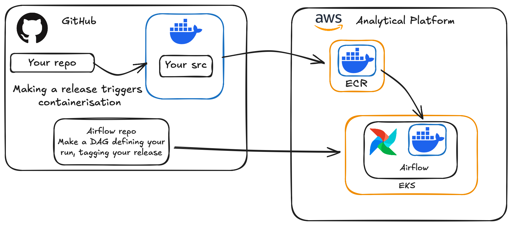

# Data Science Project Template

[](https://github-community.service.justice.gov.uk/repository-standards/data-science-template)
[](https://github.com/moj-analytical-services/data-science-template/actions/workflows/pre-commit.yml)
[](https://github.com/moj-analytical-services/data-science-template/actions/workflows/pytest.yml)

A comprehensive template repository for data science projects on the Analytical Platform, supporting both Python and R development with built-in code quality tools, testing frameworks, and CI/CD workflows.

> [!NOTE]
> We are currently in development and suggestions are welcome! Open [an issue here](https://github.com/moj-analytical-services/data-science-template/issues/new/choose).

## Quick Start

1. Click "Use this template" → Create repository
2. Clone: `git clone https://github.com/moj-analytical-services/your-repo-name.git`
3. Follow [post-clone checklist](#post-clone-checklist) below. More info in [Setup Instructions](#setup-instructions).

## Post-Clone Checklist

- [ ] **Complete initial ethics scan** (see [Ethics & SAFE-D Framework](#ethics--safe-d-framework))
- [ ] Create and activate virtual environment
- [ ] Install pre-commit hooks: `pre-commit install`
- [ ] Update this README with project details
- [ ] Update badge URLs in README
- [ ] Set GitHub repository description
- [ ] Grant team permissions (one Admin minimum)
- [ ] Review [MoJ GitHub standards](https://github-community.service.justice.gov.uk/repository-standards/guidance)

## Features

This template provides a robust foundation for data science projects:

- **🐍 Python, 🗄️ SQL & 📊 R Support**: Pre-configured for all three languages with formatting and testing
- **✅ Code Quality Tools**: Pre-commit hooks for automated formatting, linting, and security checks
- **🧪 Testing Framework**: Three-tier test structure (unit, integration, end-to-end) with pytest and testthat
- **🔒 Security Scanning**: Bandit for Python security, secrets detection, and container vulnerability scanning, as well as large file detection and nbstripout to detect if you're about to commit data
- **📝 Architecture Decision Records**: Built-in ADR tooling for documenting important decisions
- **🐳 Docker Ready**: Dockerfile included for containerised deployments on airflow using the Analytical platform workflow
- **🤖 CI/CD Workflows**: GitHub Actions for automated testing, container builds, and releases to to the ECS for use with Airflow on the analytical platform.
- **📚 Comprehensive Documentation**: README templates, ADR examples, and test documentation
- **🔄 PR and issue templates** to match common data science ways of working

## Project Structure

```text
├── data/             # Data files (gitignored)
│   ├── raw/          # Original data
│   ├── processed/    # Cleaned data
│   └── external/     # Third-party data
├── docs/             # Documentation and ADRs
├── models/           # Trained models (gitignored)
├── notebooks/
├── references/       # Data dictionaries, manuals
├── reports/          # Generated outputs (gitignored)
│   └── figures/
├── scripts/          # Executable scripts
├── src/              # Reusable source code
│   ├── data/         # Data processing
│   ├── features/     # Feature engineering
│   ├── models/       # Training and prediction
│   └── visualization/# Plotting utilities
└── tests/
    ├── unit/
    ├── integration/
    └── e2e/          # End-to-end tests
```

See individual directories for detailed READMEs. Key points:

- **data/**, **models/**, **reports/**: Gitignored to prevent committing large or sensitive files
- **src/**: Installable as package with `pip install -e .` (see [src/README.md](src/README.md))
- **scripts/**: One-off executables that use `src/` code (see [scripts/README.md](scripts/README.md))
- **notebooks/**: Use numbered prefixes with snake_case (e.g., `01_data_exploration.ipynb`)

> [!TIP]
> When starting a new project, create your module structure inside `src/` (e.g., `src/fraud_detection/`) to keep code organised and importable.



### Code Standards and Quality

This template includes pre-commit hooks for automated code quality checks. [The hooks](https://github.com/moj-analytical-services/data-science-template/blob/main/.pre-commit-config.yaml) cover:

- **Python**: Black formatting, Flake8 linting, Bandit security checks
- **R**: styler formatting, lintr linting (requires R packages: `install.packages(c("styler", "lintr"))`)
- **SQL**: SQLFluff linting and formatting
- **Notebooks**: nbstripout to remove outputs
- **General**: trailing whitespace, file size limits, secrets detection

After setting up your environment, the hooks will run automatically on each commit. You can also run them manually:

```bash
pre-commit run --all-files  # Run manually
```

**Testing:**

```bash
pytest tests/              # Python tests (unit, integration, e2e)
```

```R
testthat::test_dir("tests/unit")  # R tests
```

## Playbook

We use the [MoJ Data Science and AI Playbook](https://justiceuk.sharepoint.com/:x:/s/DataEngineeringDataScience/IQBDMxjlHr8lS7_RCPgEvjuIASQy37cBpga9N6B3nGMsyEw?e=dRsrNw) to guide projects through key stages.

## Ethics & SAFE-D Framework

> [!IMPORTANT]
> **MANDATORY REQUIREMENT**: All data science and AI projects **must** complete the [MoJ AI & Data Science Ethics Framework Process](https://justiceuk.sharepoint.com/sites/MoJAIDataEthicsHub/SitePages/Governance-Process.aspx?csf=1&web=1&e=GrR7F5). This is not optional guidance; it is a required process for responsible development of data-driven technologies.

For detailed guidance, see [CONTRIBUTING.md](CONTRIBUTING.md#ethical-considerations).

## Setup Instructions

Once you've created your repository using this template, ensure the following steps:

### Set Up Development Environment

We are aligned with the [analytical platform's guidance](https://user-guide.cloud-platform.service.justice.gov.uk/documentation/getting-started/cloud-platform-cli.html#cloud-platform-cli) on setting up a Python development environment.

1. **Create a virtual environment** (in your project directory):

   ```bash
   python3 -m venv venv
   ```

   Add `venv` to your `.gitignore` file (already included in this template).

2. **Activate the virtual environment**:

   ```bash
   source venv/bin/activate  # On macOS/Linux
   # or
   venv\Scripts\activate  # On Windows
   ```

   You'll see `(venv)` in your terminal prompt when activated.

3. **Install development dependencies**:

   ```bash
   pip install -r requirements-dev.txt
   ```

4. **Install pre-commit hooks** (for code quality):

   ```bash
   pre-commit install
   ```

5. **Install project dependencies** (when you have a `requirements.txt`):

   ```bash
   pip install -r requirements.txt
   ```

6. **Record your dependencies**:

   When you add new packages, update the requirements file:

   ```bash
   pip freeze > requirements.txt
   git add requirements.txt
   ...
   ```

### Set Up R Development Environment (Optional)

If you're working with R:

1. **Install R** (if not already installed):

   Follow the [R installation guide](https://cloud.r-project.org/) for your operating system.

2. **Install required R packages** for code quality:

   ```R
   # In R console
   install.packages(c("styler", "lintr", "testthat"))
   ```

3. **Install project-specific R packages**:

   Create a file called `install_packages.R` in your project root and list your dependencies:

   ```R
   # install_packages.R
   packages <- c(
     "dplyr",
     "ggplot2",
     "tidyr"
     # Add your packages here
   )

   install.packages(packages)
   ```

   Run it with: `Rscript install_packages.R`

4. **Alternative - Use renv for dependency management**:

   ```R
   # Initialise renv for your project
   install.packages("renv")
   renv::init()

   # Install packages (they'll be tracked by renv)
   install.packages("dplyr")

   # Create a snapshot of your dependencies
   renv::snapshot()
   ```

### Update README

Edit this README.md file to document your project accurately. Take the time to create a clear, engaging, and informative README.md file. Include information like what your project does, how to install and run it, how to contribute, and any other pertinent details.

Also make sure the badge urls are correct for your repository, e.g.:

```markdown
[](https://github.com/moj-analytical-services/YOUR-REPO-HERE/actions/workflows/pre-commit.yml)
```

### Update repository description

After you've created your repository, GitHub provides a brief description field that appears on the top of your repository's main page. This is a summary that gives visitors quick insight into the project. Using this field to provide a succinct overview of your repository is highly recommended.

### Grant Team Permissions

Assign permissions to the appropriate Ministry of Justice teams. Ensure at least one team is granted Admin permissions. Whenever possible, assign permissions to teams rather than individual users.

### Read about the GitHub repository standards

Familiarise yourself with the [GDS Way](https://gds-way.digital.cabinet-office.gov.uk). These standards ensure consistency, maintainability, and best practices across all our repositories.

### Manage Outside Collaborators

To add an Outside Collaborator to the repository, follow the [guidelines for managing GitHub collaborators](https://github.com/ministryofjustice/github-collaborators).

### Update CODEOWNERS

(Optional) Modify the CODEOWNERS file to specify the teams or users authorised to approve pull requests.

### Configure Dependabot

Adapt the dependabot.yml file to match your project's [dependency manager](https://docs.github.com/en/code-security/dependabot/dependabot-version-updates/configuration-options-for-the-dependabot.yml-file#package-ecosystem) and to enable [automated pull requests for package updates](https://docs.github.com/en/code-security/supply-chain-security).

### Dependency Review

If your repository is private with no GitHub Advanced Security license, remove the `.github/workflows/dependency-review.yml` file.

### Code of Conduct

This project follows the [Ministry of Justice's Code of Conduct](https://github.com/ministryofjustice/.github/blob/main/CODE_OF_CONDUCT.md). Please be respectful and professional in all interactions.

## License

This project is licensed under the MIT License - see the [LICENSE](LICENSE) file for details.

This license may not be appropriate for all projects, because it gives permission to anyone with access to the repo to open source a copy of it. Please review and change the license as necessary for your project.
